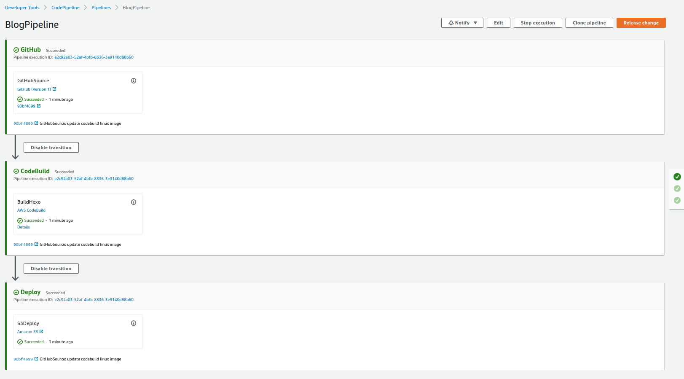

# How I create this page ?

Hôm nay, mình nổi hứng muốn tạo một blog cho AWS cũng như DevOps, cũng như thực hành các kiến thức đã học thì mình nghĩ tới việc tạo một blog sẽ sử dụng CI/CD để tự động build khi có thay đổi.  

## Tạo giao diện

Việc đầu tiên cần làm là tạo giao diện cho page. Muốn tạo một giao diện blog đẹp sẽ khá tốn thời gian, công sức. Mình cũng không chuyên về front-end nên tìm tạm một template nào đó để tạo sẵn cho mình thôi.  
Lượn lờ một vòng thấy có [blog](https://hackernoon.com/build-a-serverless-production-ready-blog-b1583c0a5ac2) hướng dẫn cách host serverless blog trên S3.  

Từ đó, mình thấy khá thú vị và dễ dàng thực hiện nên quyết định dùng [hexo](https://hexo.io/) framework để tạo giao diện cũng như các chức năng thông thường của một blog.  

Install bằng câu lệnh :  

```bash
npm install -g hexo-cli
```

Khởi tạo blog:  

```bash
hexo init hacmaoblog
```

Sau đó mò dần rồi custom từng thành phần. Mình lựa chọn theme [pure](https://github.com/cofess/hexo-theme-pure).  

Trong thư mục của project vừa tạo, ta thực hiện clone theme :  

```bash
git clone https://github.com/cofess/hexo-theme-pure.git themes/pure
```

Sau đó, trong file `_config.yml`, sửa `theme: landscape` thành `pure`.  

Ban đầu theme tải về sẽ toàn tiếng tàu khựa :v Còn có link donate các kiểu, tốn khá thời gian để config lại thành của mình. Sửa trong file `_config.yml` của thư mục `themes/pure` với các file `.ejs` dùng để tạo các file. Nói chung mò một lúc sẽ ra.  

Chạy hexo server :  

```bash
hexo server
```

Cuối cùng được thành phẩm như hiện tại :v Cũng khá là vừa ý.  

Một số lệnh cơ bản của `hexo`:  

```bash
# Tạo post
hexo new post 'hello world'

# Tạo page
hexo new page 'aboutme'
```

## Build CI/CD  

Mình sẽ làm CI/CD đơn giản thôi. Tạo một `Codepipeline` lấy code từ github hoặc codecommit, sau đó tiến hành dùng `Codebuild` tạo 1 cloudformation để deploy app lên S3 Bucket.  

Mình đã nghĩ tới việc tạo container cho chuyên nghiệp, cơ mà thế thì blog lại tốn kha khá chi phí duy trì cho ECS, NAT, ELB, ... Nên thôi sự lựa chọn S3 vừa dễ setup lại hợp với túi tiền.  

  
